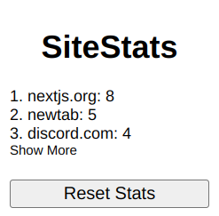
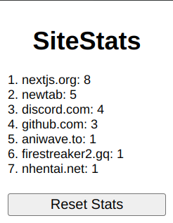

# About
SiteStats is a simple extension to track your most visited sites.

# Usage
1. Download the files using whatever method you want
2. Navigate to ``chrome://extensions`` (or the corresponding extensions page for your browser)
3. Enable Developer Mode
4. Click ``Load unpacked``
5. Select SiteStats
6. profit

# Example Images
Default View    
   
Expanded View    

# License
[MIT](https://github.com/FireStreaker2/SiteStats/blob/main/LICENSE)